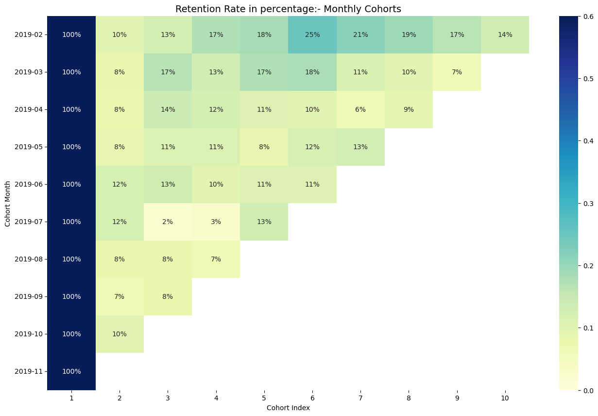

# Customer Churn Analysis - E-Commerce Company

## Background
In response to a significant decline in product revenue, our e-commerce company has engaged the data science team to understand and address the issue of customer churn. The team is tasked with analyzing customer behavior, exploring historical data, and employing methodologies like RFM (Recency, Frequency, Monetary) analysis to uncover insights.

## Objective
The primary objective of this project is to decrease the churn rate to 20% within the next two months. By delving into customer behavior patterns and leveraging cohort analysis, we aim to identify factors contributing to churn and implement targeted strategies for retention.

## Cohort Analysis
Cohort analysis is a fundamental part of our approach. We'll assess the retention rate by examining cohorts of customers each month. The corrected retention rate formula is:

**Retention Rate** = _(Sum of Initial Customers / Sum of Customers Still Active in the Next Month) × 100_

This analysis will help us understand how well we are retaining customers over time and pinpoint areas for improvement.

Cohort Analysis
 

We observed the highest retention rate of 25% from customers in index 6, but it decreases over the next 6 months, reaching a minimum in the 7th month before dropping significantly in the next month.
The Average Monthly Retention Rate for All Customers is 12.16%, while the Average Monthly Churn Rate for All Customers is 87.84%.

## Churn Analysis with RFM
For the RFM churn analysis, we define a churned customer as one who has not made any transactions during weeks 31 to 35, within a time window of 5 weeks. The results show that we have 8,698 churned customers and 4,066 unchurned customers within this defined period.

This RFM-based churn analysis provides additional insights into customer behavior during a specific time window, allowing us to pinpoint customers at risk of churn. The combination of cohort and RFM analyses enhances our understanding of churn dynamics, enabling us to develop targeted retention strategies.
